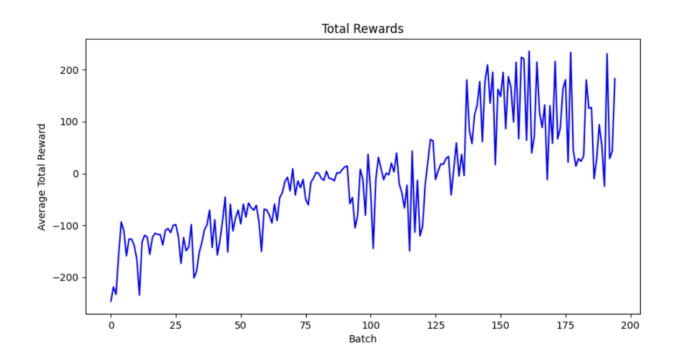
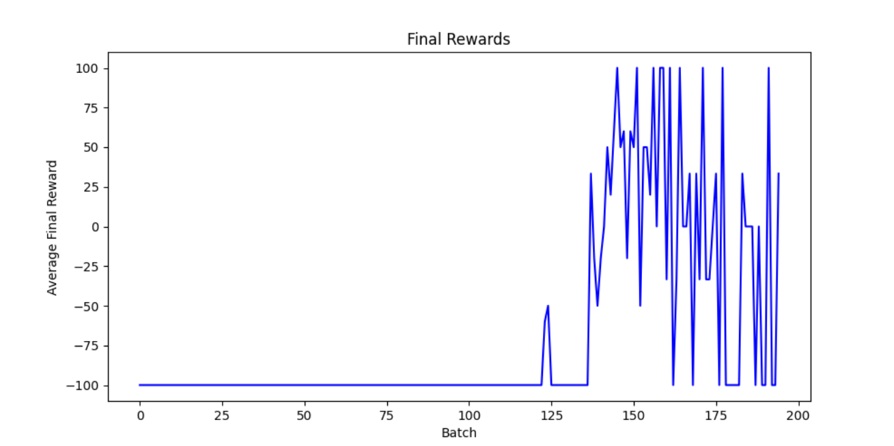
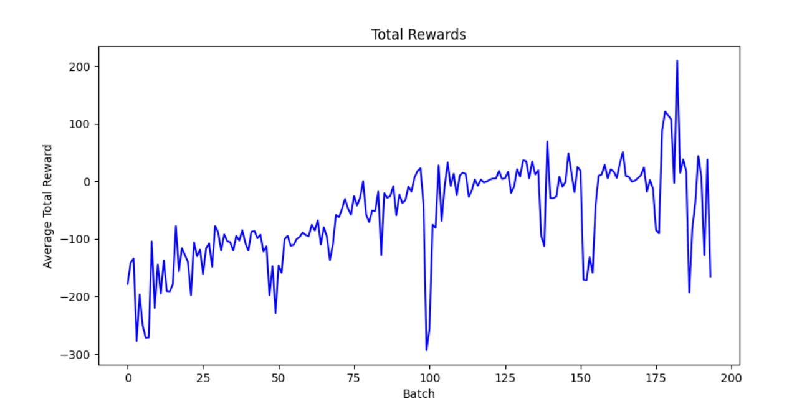
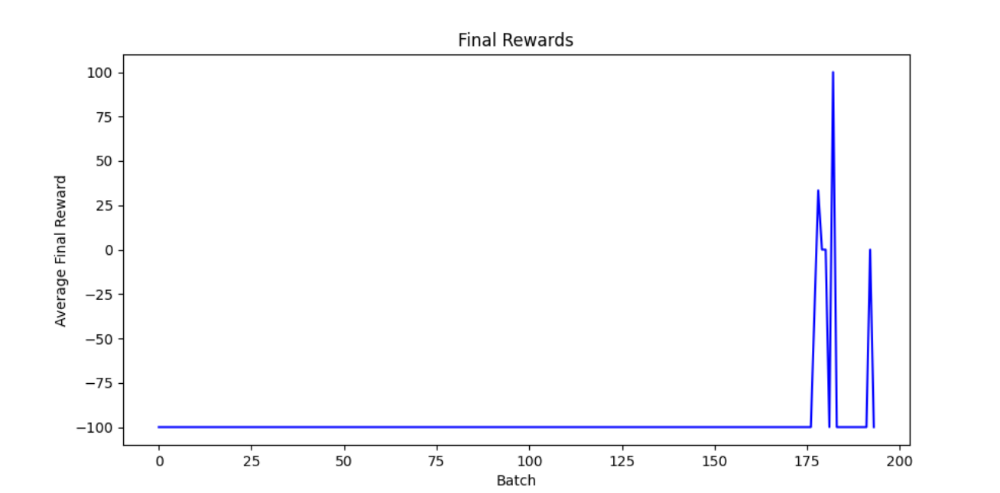
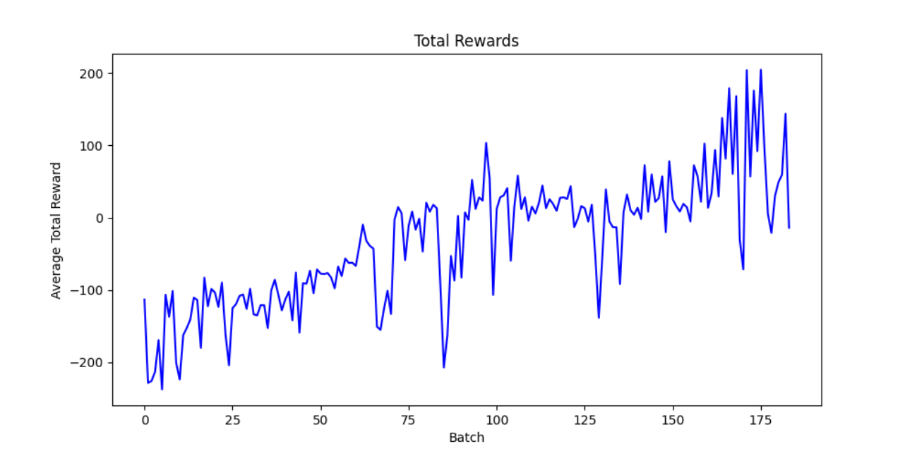
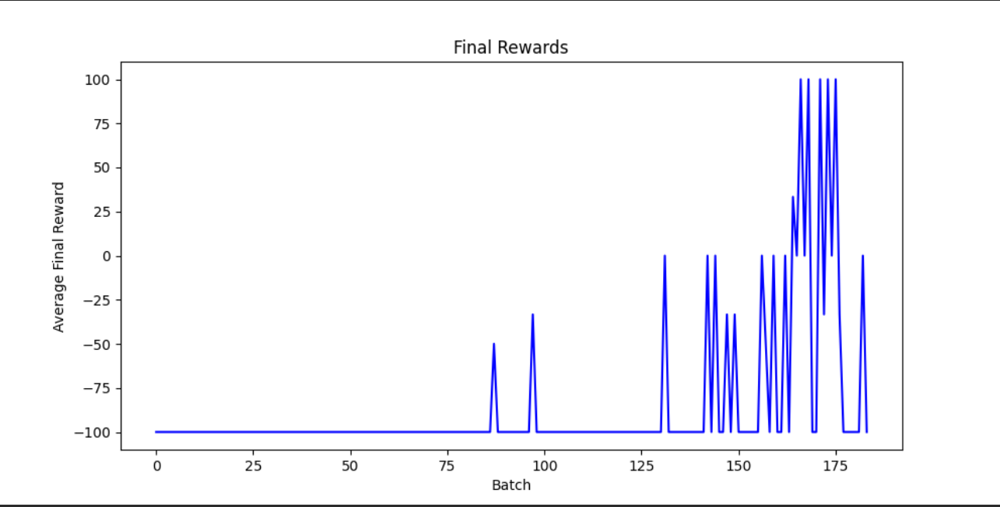

# 实现ppo三种变种算法
## 实验报告
### 一、实验内容
1.完成PPO三种变种算法  
2.实现在LunarLander-v2环境下的训练
### 二、实验过程
#### 1.配置环境
##### (1)通过cmd配置虚拟环境gym  
```python
conda create -n gym python=3.8.3
```
##### (2)安装pytorch框架和gym的一般库
  ```python
conda install pytorch
pip3 install gym matplotlib -i  https://pypi.tuna.tsinghua.edu.cn/simple
  ```
##### (3)安装box2d
```python
conda install -c conda-forge box2d-py
```
##### (4)安装pygame  
通过下载pygame-2.1.2-cp38-cp38-win_amd64.whl进行安装，在Unofficial Windows Binaries for Python Extension Packages网站下载好pygame，并将文件放到了Python的安装目录下（并新建文件夹 mypackage），再在虚拟环境进行下载
```python
pip install "D:\Python3.8位置\mypackage\pygame-2.1.2-cp38-cp38-win_amd64.whl"
```
##### (5)测试环境  
运行以下代码没有报错证明环境配置成功
  ```python
import gym
env = gym.make('LunarLander-v2' ,render_mode='rgb_array')
  ```
#### 2.算法代码
##### (1)整体框架
三种变种算法均是由Memory、ActorCriticDiscrete和PPOAgent三部分组成  

Memory：将数据存储至Memory并可以清除数据   
数据包括动作actions、状态states、对数概率logprobs、奖励rewards、是否结束is_terminals  

ActorCriticDiscrete：包括两大部分，act和evaluate   
在初始化部分定义action_layer和value_layer两个神经网络，action_layer预测动作概率，value_layer预测价值    
def act：从动作概率分布采样获取动作  
def evaluate：计算对数概率并估计出未来奖励state_value  

PPOAgent：初始化、update、step、act    
update：计算折扣奖励、概率比率、优势函数、损失函数，实现梯度下降优化  
step：收集与环境交互的数据，并通过步长来决定是否更新    
act：调用旧策略的act  
##### (2)三种不同
三种变种算法不同主要体现在对损失函数的计算上  
###### a.PPO_clip
只使用clip裁剪
  ```python
advantages = rewards - state_values.detach()
surr1 = ratios * advantages  
surr2 = torch.clamp(ratios, 1-self.eps_clip, 1+self.eps_clip) * advantages
loss = -torch.min(surr1, surr2)  + 0.5*self.MseLoss(state_values, rewards) - 0.01*dist_entropy
  ```
###### b.PPO_KL
在clip基础上添加Adaptive KL Penalty Coefficient
  ```python
# 计算KL散度
kl = torch.mean(old_logprobs - logprobs)
# 如果KL大于最大值，则增加beta
if kl > self.kl_max:
    self.beta *= 2
# 如果KL小于最小值，则减少beta
if kl < self.kl_min:
    self.beta /= 2
# Loss现在有一个额外的beta参数来调整KL散度项的权重
loss = -torch.min(surr1, surr2) + 0.5*self.MseLoss(state_values, rewards) - 0.01*dist_entropy + self.beta*kl
  ```
###### c.PPO_Trust_Region
不使用beta自动调节KL散度的权重，限制KL散度在一个信任域内
  ```python
  if kl > self.kl_max:
      self.policy.load_state_dict(old_policy.state_dict())
      print("Exceeded KL max, rollback!")
      break
loss = -torch.min(surr1, surr2) + 0.5*self.MseLoss(state_values, rewards) - 0.01*dist_entropy + kl
  ```
#### 3.训练
参数设置
  ```python
state_dim = 8   
action_dim = 4  
update_timestep = 1200  #当timestep达到1200执行update()
lr = 0.002
betas = (0.9, 0.999)  # Adam优化器参数
gamma = 0.99
K_epochs = 4               
eps_clip = 0.2
kl_min = 0.01
kl_max = 0.1
beta = 0.1
EPISODE_PER_BATCH = 5  # 决定了每次策略更新前要玩多少次游戏（即收集多少回合的数据）
NUM_BATCH = 200     # 定义了整个训练过程要重复多少次数据收集和策略更新的循环
  ```
### 三、实验结果
实验结果分为avg_total_reward和avg_final_reward  
avg_total_reward：一整局游戏下来的总得分  
avg_final_reward：一局游戏最后一步的得分，100分意味着成功着陆  
计算公式如下  
  ```python
avg_total_reward = sum(total_rewards) / len(total_rewards)
avg_final_reward = sum(final_rewards) / len(final_rewards)
  ```
#### 1.PPO_clip
Total_rewards:  
  
Final_rewards:  
  
#### 2.PPO_KL
Total_rewards:  
  
Final_rewards:  
  
#### 3.PPO_Trust_Region
Total_rewards:  
  
Final_rewards:  

### 四、实验总结
1.理论是梯度上升，代码是通过损失函数进行梯度下降优化    
2.关于update_timestep、EPISODE_PER_BATCH、NUM_BATCH等训练参数的选择没有清楚的概念    
3.从实验结果上看PPO_clip效果最好，Total_reward能接近300分，PPO_KL和PPO_Trust_Region的Total_reward都到不了300分，有可能是KL相关参数的设定问题或者损失函数的定义问题  
4.测试部分代码还在学习中，后续补充
